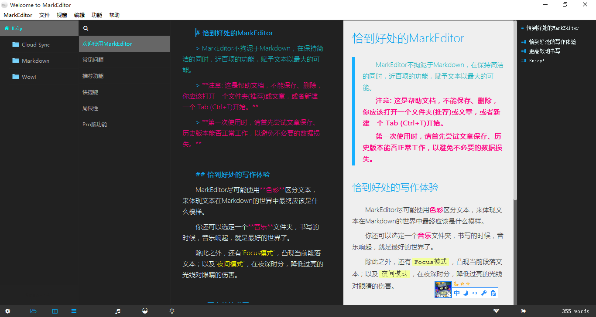
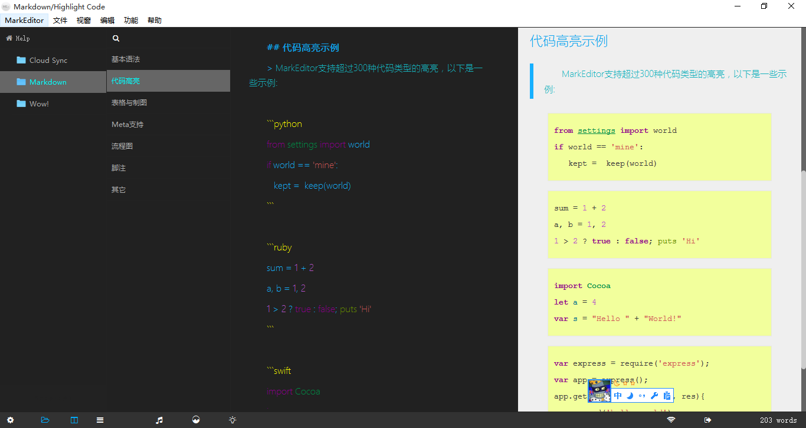
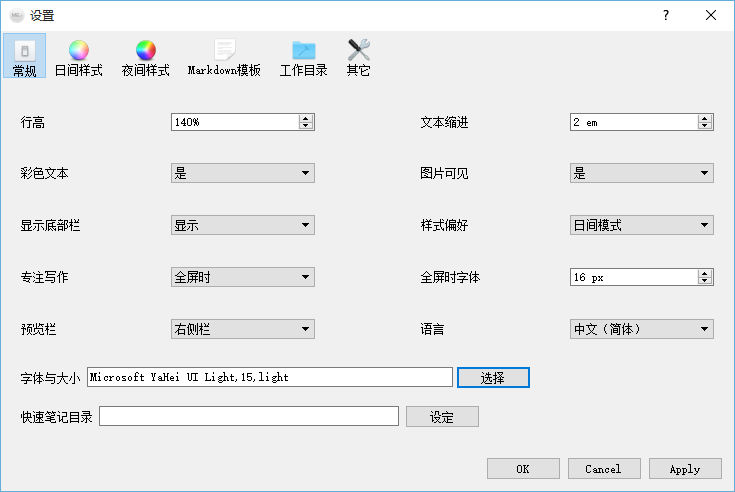

# MarkEditor DarkStyle样式

- - - - -
## 如何使用这个样式
1. 下载`MEStyle.css`, 以文本格式打开.
2. 打开MarkEditor的设置(软件左下角).
3. 在日间样式(或夜间样式)中用`MEStyle.css`中的内容替换, 单击应用样式即可.

## 样式预览
### [帮助文档]

### [代码高亮]

## 其他说明
可按照个人习惯进行调整。
1. 其中`pygments_style`的可选项有`monokai, manni, rrt, perldoc, borland, colorful, default, murphy, vs, trac, tango, fruity, autumn, bw, emacs, vim, pastie, friendly, native`，效果见[这里](https://havee.me/internet/2013-08/support-pygments-in-jekyll.html)
2. 以上截图中所使用的常规设置如下

